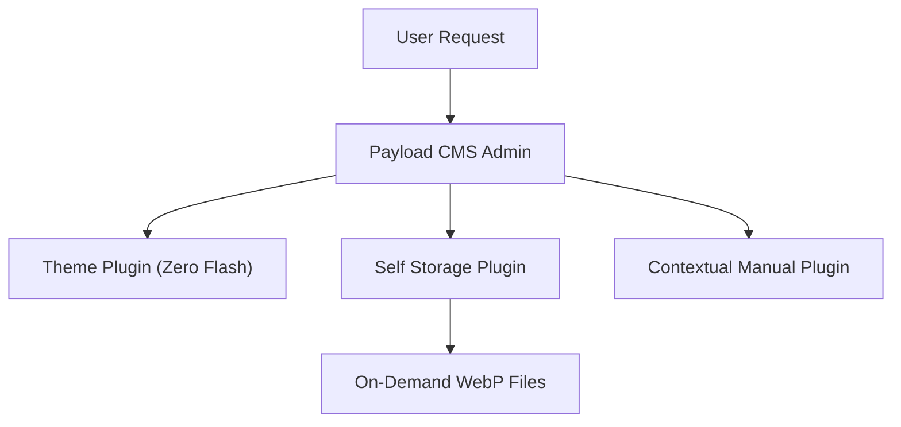

# Dashboard & User Manual

Welcome to Payload CMS Administration Panel!

## System Plugins Architecture

Below is the architectural diagram of the 5 ecosystem plugins:

### Interactive Mermaid Diagram

---

## Quick Navigation

- 📁 **[Go to Media Collection Guide](#doc:collections/media)**
- 🌐 **[Payload CMS Documentation (External Link)](https://payloadcms.com)**

## Keyboard Shortcuts
- `⌘ /` or `Ctrl + /` — Toggle this manual modal
- `Esc` — Close help modal
- `⌘ Enter` — Quick save current document
