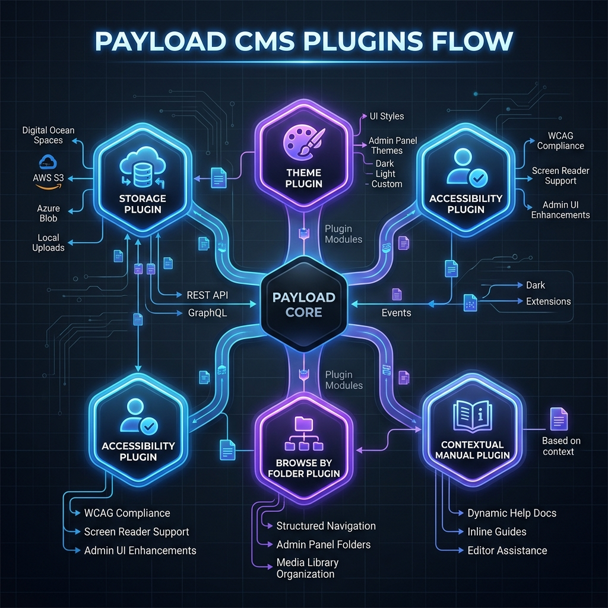
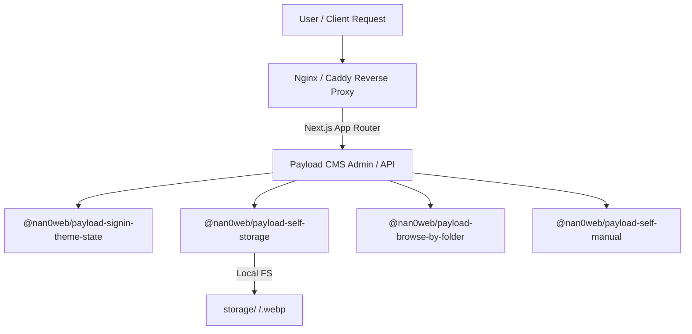

# 🏛 Architecture of `@nan0web/payload-*` Ecosystem

This document specifies the global monorepo architecture, plugin interrelationships, and deployment standards across server infrastructure (Nginx / Caddy / CDN).



---

## 1. Monorepo Structure

The monorepo is structured following a strict separation of concerns:

```text
payload-cms/
├── packages/                       # Suite of standalone ESM plugins
│   ├── payload-self-storage/       # Physical file storage, WebP conversion, folder hierarchy
│   ├── payload-browse-by-folder/   # Tree UI for media navigation
│   ├── payload-signin-theme-state/ # Admin theme state persistence (Zero Flash)
│   ├── payload-self-manual/        # Contextual documentation viewer (⌘/)
│   └── payload-keyboard-accessibility/ # Keyboard focus and submit shortcuts
├── testing-app/                    # Integration sandbox (Next.js 16 + Payload 3.x)
└── docs/                           # Standardized localized documentation
    ├── media/architecture.png      # Global architectural diagram
    ├── uk/workflows/               # Ukrainian workflow instructions
    └── en/workflows/               # English workflow instructions
```

---

## 2. Plugin Ecosystem & Interaction

Every plugin implements the **OLMUI (One Logic — Multiple UI)** principle and **Payload 3.x ESM Standard**:



1. **`payload-self-storage`**:
   - Automatically structures uploaded media by folders in local `storage/`.
   - Converts images to WebP format on-the-fly.
   - Supports custom path prefixes (`publicUrlPrefix: ''` for clean URLs like `/folder/image.webp`).
2. **`payload-browse-by-folder`**:
   - Extends Admin UI to navigate and filter media by folder tree.
3. **`payload-signin-theme-state`**:
   - Manages light/dark theme state without flicker (Zero Flash) via `first-paint.js`.
4. **`payload-self-manual`**:
   - Integrates contextual documentation modal triggered via `⌘/` / `Ctrl+/`.
5. **`payload-keyboard-accessibility`**:
   - Provides comprehensive keyboard navigation and shortcut handling.

---

## 3. Server Infrastructure (Nginx / Caddy / CDN)

### A. Caddy Server Configuration (Recommended for SSL & Reverse Proxy)
```caddy
example.com {
    # Reverse proxy all traffic to Next.js / Payload 3.x server
    reverse_proxy localhost:3000

    # Cache control for media assets
    @media path /media/* /api/media/*
    header @media Cache-Control "public, max-age=31536000, immutable"

    @static_files path *.webp *.png *.jpg *.jpeg *.svg *.pdf
    header @static_files Cache-Control "public, max-age=31536000, immutable"
}
```

### B. Nginx Server Configuration
```nginx
server {
    listen 80;
    server_name example.com;

    location / {
        proxy_pass http://127.0.0.1:3000;
        proxy_http_version 1.1;
        proxy_set_header Upgrade $http_upgrade;
        proxy_set_header Connection 'upgrade';
        proxy_set_header Host $host;
        proxy_cache_bypass $http_upgrade;
    }

    # Redirect flat links to folder structure if needed
    location ~* ^/media/(.*)$ {
        try_files $uri @proxy;
    }

    location @proxy {
        proxy_pass http://127.0.0.1:3000;
    }
}
```

---

## 4. Development Pipeline for New Payload CMS Applications

1. **Define Requirements & Stack Design**:
   - Outline required collections and fields.
   - Define file storage layout (`publicUrlPrefix`, CDN domain).
2. **Connect Required Plugins**:
   - Add `@nan0web/payload-*` plugins into `payload.config.ts`.
3. **Integration Verification (`testing-app`)**:
   - Execute `pnpm test` and verify production build `pnpm build`.
4. **Deployment & Proxy Configuration**:
   - Configure reverse proxy and caching headers in Caddy or Nginx.
