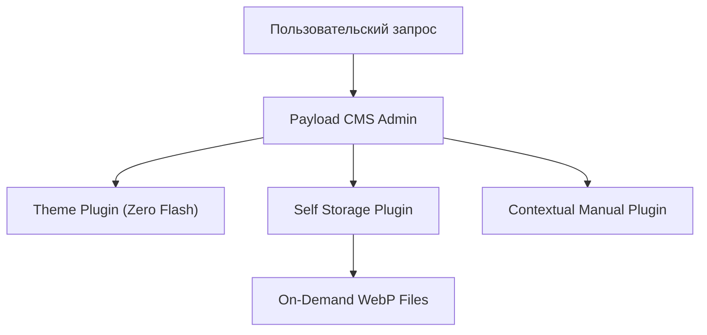

# Панель керування та Інструкція користувача

Ласкаво просимо до адміністративної системи Payload CMS!

## Архітектура плагінів системи

Нижче представлена схема взаємодії 5 плагінів нашої екосистеми:

### Інтерактивна діаграма Mermaid

---

## Швидка навігація

- 📁 **[Перейти до інструкції з Медіа-файлів](#doc:collections/media)**
- 🌐 **[Офіційна документація Payload CMS (Зовнішнє посилання)](https://payloadcms.com)**

## Швидкі клавіші
- `⌘ /` або `Ctrl + /` — Перемикання цієї довідки
- `Esc` — Закрити модальне вікно
- `⌘ Enter` — Швидке збереження форми
