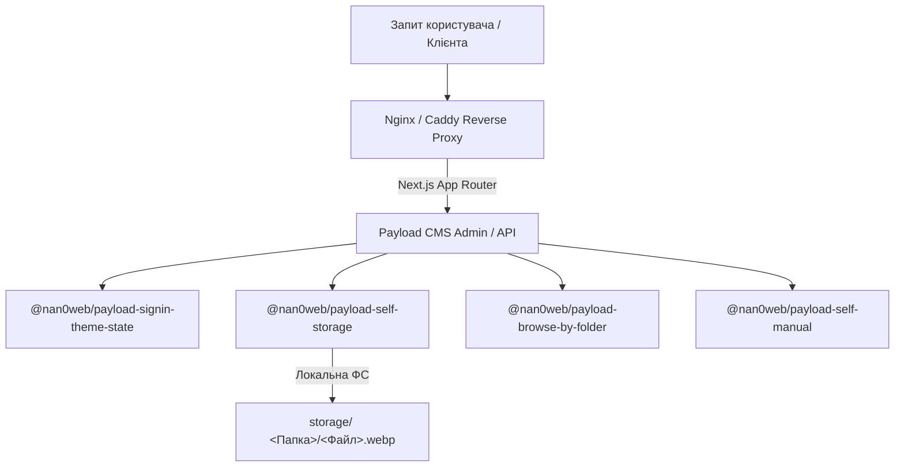

# 🏛 Архітектура Екосистеми `@nan0web/payload-*`

Цей документ визначає глобальну архітектуру монорепозиторію, взаємозв'язок плагінів та стандарти розгортання на серверній інфраструктурі (Nginx / Caddy / CDN).


---

## 1. Структура Монорепозиторію

Монорепозиторій побудований за принципом чистого розмежування відповідальності:

```text
payload-cms/
├── packages/                       # Набір автономних ESM-плагінів
│   ├── payload-self-storage/       # Збереження медіафайлів, WebP, ієрархія папок
│   ├── payload-browse-by-folder/   # Деревоподібний UI для фільтрації медіа
│   ├── payload-signin-theme-state/ # Тематизація адмінки (Zero Flash)
│   ├── payload-self-manual/        # Контекстна довідка (⌘/)
│   └── payload-keyboard-accessibility/ # Доступність клавіатури
├── testing-app/                    # Інтеграційний пісочник (Next.js 16 + Payload 3.x)
└── docs/                           # Стандартизована локалізована документація
    ├── media/architecture.png      # Загальна архітектурна схема
    └── uk/workflows/               # Автономні робочі інструкції
```

---

## 2. Екосистема Плагінів та їх Взаємодія

Кожен плагін реалізує принцип **OLMUI (One Logic — Multiple UI)** та **Payload 3.x ESM Standard**:



1. **`payload-self-storage`**:
   - Автоматично структурує файли за папками в локальній директорії `storage/`.
   - Конвертує зображення у формат WebP на льоту.
   - Підтримує довільні префікси шляхів (`publicUrlPrefix: ''` для чистих URL на кшталт `/folder/image.webp`).
2. **`payload-browse-by-folder`**:
   - Розширює Admin UI для навігації та фільтрації файлів за структурою папок.
3. **`payload-signin-theme-state`**:
   - Управляє світлою/темною темою без ефекту миготіння (Zero Flash) за допомогою `first-paint.js`.
4. **`payload-self-manual`**:
   - Інтегрує контекстну довідкову систему за клавішею `⌘/`.
5. **`payload-keyboard-accessibility`**:
   - Забезпечує повноцінну навігацію з клавіатури.

---

## 3. Серверна Інфраструктура (Nginx / Caddy / CDN)

Проєкт розрахований на розгортання за різними архітектурними сценаріями:

### А. Конфігурація Caddy Server (Рекомендовано для швидкого SSL & Reverse Proxy)
```caddy
example.com {
    # Проксіювання всього трафіку на Next.js / Payload 3.x сервер
    reverse_proxy localhost:3000

    # Оптимізація та кешування медіафайлів (за розширеннями або шляхом)
    @media path /media/* /api/media/*
    header @media Cache-Control "public, max-age=31536000, immutable"

    @static_files path *.webp *.png *.jpg *.jpeg *.svg *.pdf
    header @static_files Cache-Control "public, max-age=31536000, immutable"
}
```

### Б. Конфігурація Nginx Server
```nginx
server {
    listen 80;
    server_name example.com;

    location / {
        proxy_pass http://127.0.0.1:3000;
        proxy_http_version 1.1;
        proxy_set_header Upgrade $http_upgrade;
        proxy_set_header Connection 'upgrade';
        proxy_set_header Host $host;
        proxy_cache_bypass $http_upgrade;
    }

    # Редірект зі старих плоских посилань на нову структуру (якщо потрібно)
    location ~* ^/media/(.*)$ {
        try_files $uri @proxy;
    }

    location @proxy {
        proxy_pass http://127.0.0.1:3000;
    }
}
```

---

## 4. Пайплайн Розробки Нового Додатка на базі Payload CMS

При започаткуванні нового проєкту дотримуйтесь наступного алгоритму:

1. **Визначення вимог та стек-дизайну**:
   - Окресліть потрібні колекції та поля.
   - Визначте структуру сховища файлів (`publicUrlPrefix`, домен CDN).
2. **Підключення необхідних плагінів**:
   - Підключайте плагіни з пакета `@nan0web/payload-*` у `payload.config.ts`.
3. **Інтеграційне тестування (`testing-app`)**:
   - Запустіть тестування `pnpm test` та перевірте збірку `pnpm build`.
4. **Деплоймент та конфігурація Caddy/Nginx**:
   - Налаштуйте reverse proxy та правильне кешування статичних ресурсів.
