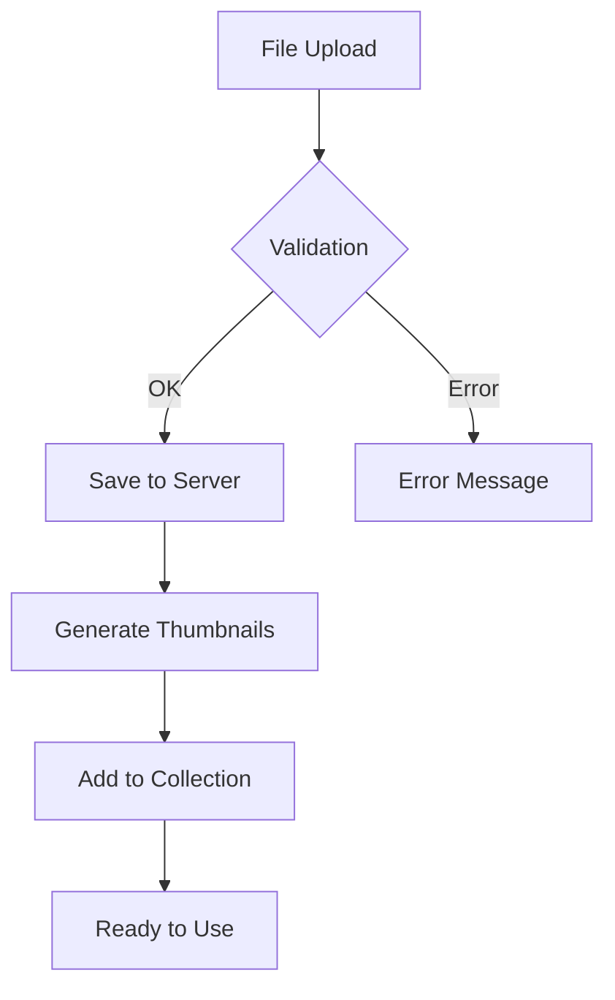

# Media Collection & Storage

Managing media files in Payload CMS.

## Key Features

- Upload images, videos, documents
- Automatic thumbnail generation
- Organization via tags and categories
- Cloud storage support (S3, Cloudinary, etc.)

## Media Workflow Diagram



## Example Embedded Image


## Useful Links

- [Official Payload CMS Media Documentation](https://payloadcms.com/docs/media/overview)
- [Cloud Storage Configuration](https://payloadcms.com/docs/storage/overview)

## Tips & Tricks

1. **Image Optimization**: Use WebP format for better quality and smaller size
2. **Tags**: Add tags to media for easy searching
3. **Alternative Text**: Always fill alt-text for accessibility

## API Examples

```javascript
// Upload media via API
const media = await payload.create({
  collection: 'media',
  data: {
    alt: 'My image',
    // other fields
  }
})
```
