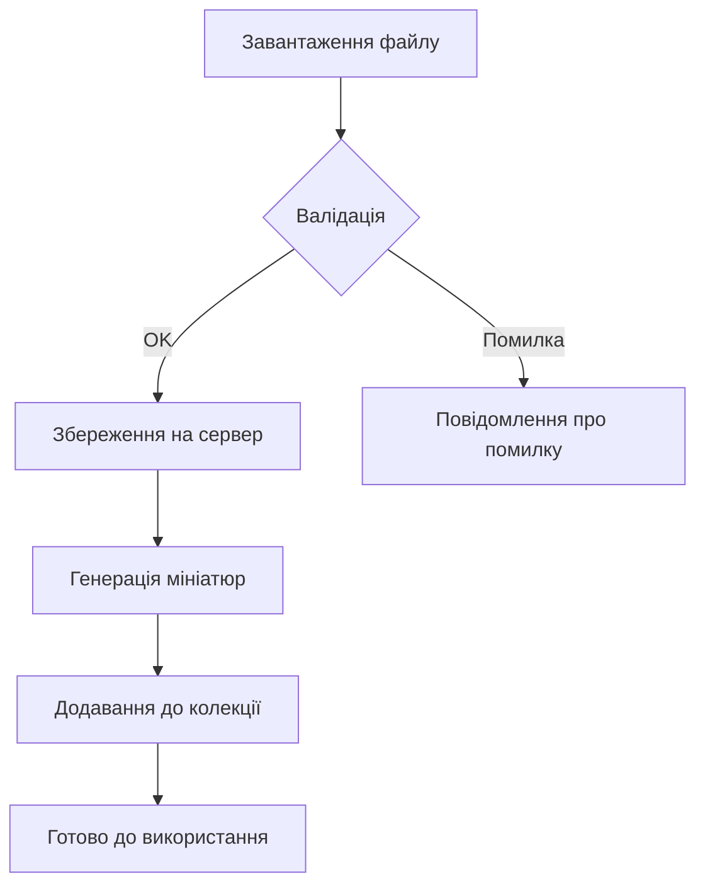

# Медіа колекція та зберігання

Керування медіа-файлами у Payload CMS.

## Основні можливості

- Завантаження зображень, відео, документів
- Автоматична генерація мініатюр
- Організація через теги та категорії
- Підтримка хмарних сховищ (S3, Cloudinary тощо)

## Схема роботи з медіа



## Приклад вбудованого зображення


## Корисні посилання

- [Офіційна документація Payload CMS по медіа](https://payloadcms.com/docs/media/overview)
- [Налаштування хмарного сховища](https://payloadcms.com/docs/storage/overview)

## Tips & Tricks

1. **Оптимізація зображень**: Використовуйте WebP формат для кращої якості та меншого розміру
2. **Теги**: Додавайте теги до медіа для зручного пошуку
3. **Альтернативний текст**: Завжди заповнюйте alt-text для доступності

## API приклади

```javascript
// Завантаження медіа через API
const media = await payload.create({
  collection: 'media',
  data: {
    alt: 'My image',
    // інші поля
  }
})
```
